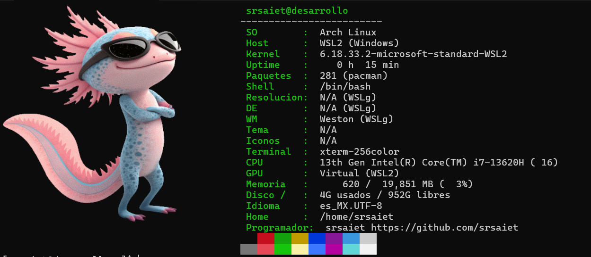

# Neofetch

Neofetch escrito en **COBOL** (compilador `gcobol` de GCC 16+): muestra el logo como
imagen real (sixel) junto a la información del sistema, al estilo Garuda/neofetch.

## Qué muestra

Usuario, equipo, SO, host, kernel, uptime, paquetes, shell, resolución, DE, WM,
tema, iconos, terminal, CPU (con núcleos), GPU, memoria (con %), disco, idioma,
home + paleta de colores.

## Requisitos (Linux nativo)

- `gcobol` (GCC 16 o superior, incluye frontend COBOL) o GnuCOBOL 3.x
- `python3` (solo herramientas de compilación del logo)
- `pacman` (la línea de paquetes usa `pacman -Qq`; en Debian/Ubuntu adapta a `dpkg -l`)
- Terminal con soporte **sixel** (WezTerm, Kitty, foot, Contour, Windows Terminal ≥ 1.22)
- Linux con `/proc` y `/sys`

## Compilar y ejecutar

```
gcobol -o neofetch neofetch.cob
./neofetch
```

El base64 de la imagen va incrustado en el propio `neofetch.cob`
(decodificado en COBOL puro, sin dependencias externas para la imagen).





## Cambiar el logo

1. Renderiza: `chafa -f sixels -s 999x20 logo.png > logo.six`
2. Regenera el base64: `python3 genb64.py` → `b64data.cpy`
3. Reincrusta: `python3 inline_b64.py`
4. Recompila.

## Notas

- En WSL muestra valores adaptados (`WSL2`, `Weston (WSLg)`, GPU virtual).
- Sin `lspci`/`xrandr`/GTK instalado, esos campos salen `N/A` (a propósito, no rompe).
- `padlogo.py`, `checkwidth.py`, `recorta.py` son utilidades de desarrollo del logo.


Se permite la modificacion total o parcial, dejando unicamente el nombre del programador y el enlace a este repositorio
